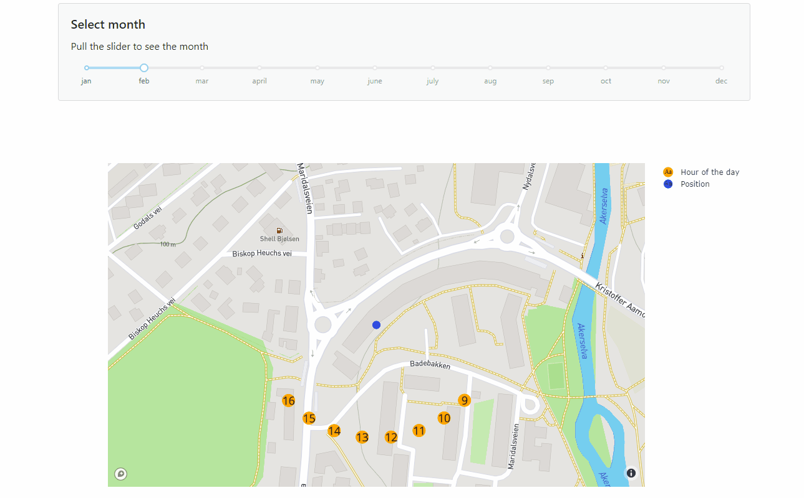

# Solar path
Repository for visualising the sun's position on the sky for a given location.
The sun's position at each hour of a day is visualised. The closer the orange
points are to the location, the higher is the solar height.

## Install
This project uses [poetry](https://python-poetry.org/).
Clone the repository, navigate to the folder and run `poetry install`.
This creates a virtual environment for the project.

## Mapbox token
A [mapbox token](https://docs.mapbox.com/api/accounts/tokens/) is required to render the map
