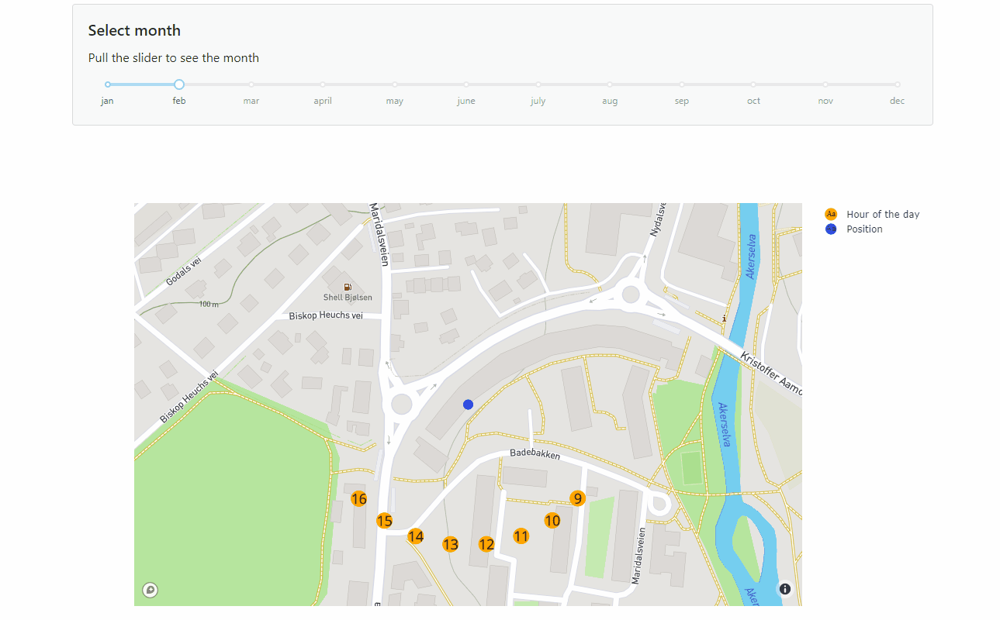

# Solar path
Repository for visualising the sun's position on the sky for a given location.
The sun's position at each hour of a day is visualised. The closer the orange
points are to the location, the higher is the solar height.  

## Install
This project uses [pipenv](https://pipenv-fork.readthedocs.io/en/latest/).
Clone the repository, navigate to the folder and run `pipenv install`.
 This creates a virtual environment for the project. 